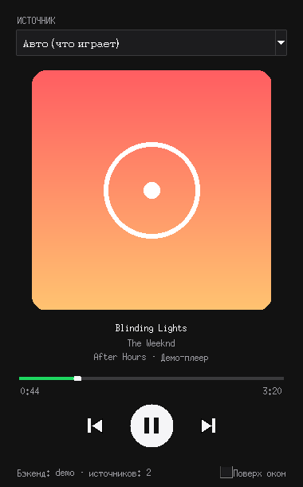

# Now Playing Player

Маленький плеер-виджет, который **видит, какая музыка сейчас играет у вас на компьютере** — в браузере (YouTube, Яндекс Музыка, SoundCloud, VK Музыка, Spotify Web…) или в приложении (Spotify, Яндекс Музыка, Apple Music, VLC, AIMP…) — и позволяет ей управлять.



## Что умеет

- Показывает название трека, исполнителя, альбом, обложку и приложение-источник
- Прогресс-бар с текущей позицией и длительностью
- Кнопки «назад / пауза / вперёд» управляют тем приложением, где реально играет музыка
- Если музыка играет в нескольких местах — можно выбрать источник в выпадающем списке (по умолчанию «Авто»: берётся тот, что играет)
- Режим «Поверх окон»
- Горячие клавиши: `Пробел` — пауза, `←` / `→` — предыдущий / следующий трек
- Консольный режим и вывод в JSON — удобно для скриптов, OBS, статуса в Discord и т.п.

## Как это работает

Программа ничего не «подслушивает» — она читает стандартный системный интерфейс медиа, в который браузеры и плееры сами сообщают, что играет:

| ОС | Механизм | Что нужно |
|---|---|---|
| **Windows 10/11** | System Media Transport Controls (та же плашка, что появляется при нажатии клавиш громкости) | пакеты `winrt-*` из `requirements.txt` |
| **Linux** | MPRIS через D-Bus | утилита `playerctl` |
| **macOS** | системный Now Playing через [`media-control`](https://github.com/ungive/media-control), запасной вариант — AppleScript для Spotify и Apple Music | `brew install media-control` (желательно) |

## Установка

Нужен Python 3.9+.

```bash
git clone https://github.com/marsek777/now-playing-player.git
cd now-playing-player
python -m venv .venv
# Windows:
.venv\Scripts\activate
# Linux / macOS:
source .venv/bin/activate

pip install -r requirements.txt
```

Дополнительно:

- **Linux:** `sudo apt install playerctl python3-tk` (Fedora: `sudo dnf install playerctl python3-tkinter`, Arch: `sudo pacman -S playerctl tk`)
- **macOS:** `brew install media-control`

## Запуск

```bash
python -m nowplaying            # окно плеера
python -m nowplaying --demo     # демо без реальной музыки — проверить интерфейс
python -m nowplaying --cli      # в консоли: печатает каждую смену трека
python -m nowplaying --once     # показать, что играет сейчас, и выйти
python -m nowplaying --once --json   # то же в JSON
```

Пример вывода `--once`:

```
▶ [Spotify] The Weeknd — Blinding Lights  (0:42 / 3:20)
⏸ [Google Chrome] YouTube — Lo-fi hip hop radio  (--:-- / --:--)
```

Можно установить как команду: `pip install .` → затем просто `nowplaying`.

### Сборка .exe для Windows

```bash
pip install pyinstaller
pyinstaller --noconsole --onefile --name NowPlaying --collect-submodules winrt run.py
```

Готовый файл появится в `dist/NowPlaying.exe`.

## Если трек не виден

- **Браузер (Windows):** в Chrome/Edge интеграция с системой включена по умолчанию. В Firefox проверьте `about:config` → `media.hardwaremediakeys.enabled = true`.
- **Браузер (Linux):** Chrome и Firefox публикуют MPRIS сами; проверить можно командой `playerctl -l`.
- **macOS 15.4+:** Apple закрыла прямой доступ к Now Playing для сторонних программ, поэтому для браузеров нужен `media-control`. Без него будут видны только Spotify и Apple Music.
- Некоторые сайты не передают обложку или длительность — тогда вместо них показывается заглушка и `--:--`.

## Структура проекта

```
nowplaying/
  cli.py              # аргументы командной строки, консольный режим
  gui.py              # окно плеера (tkinter + Pillow)
  models.py           # TrackInfo и вспомогательные функции
  backends/
    windows.py        # Windows SMTC
    linux.py          # MPRIS / playerctl
    macos.py          # media-control / AppleScript
    demo.py           # имитация для проверки интерфейса
tests/
```

Добавить новую платформу просто: унаследуйтесь от `MediaBackend` и реализуйте `get_sessions`, `play_pause`, `next`, `previous`.

## Тесты

```bash
pip install pytest
python -m pytest
```

## Лицензия

MIT
